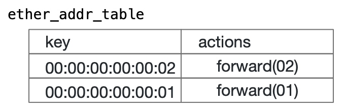

## Tutorial 4: パケットの往復

Tutorial 3 に加えて、以下の図のようにもう一つエントリをテーブルに追加し、二つのホストの間でping パケットが正しく往復することを確認します。



###  ファイルのコピー

エントリ追加実験の際に使った 1to2.txt は h2 の MAC アドレス 00:00:00:00:00:02 向けのパケットを port 2 に送るメッセージでした。この復路に相当するメッセージが 2to1.txt にあります。作業用に作った /tmp/ether_switch ディレクトリにコピーします。ファイルの中身は以下の通りです。
```bash
$ cat /tmp/ether_switch/return.txt 
updates {
  type: INSERT
  entity {
    table_entry {
      table_id: 33592100
      match {
        field_id: 1
        exact {
          value: "\000\000\000\000\000\001" # Octal expression
        }
      }
      action {
        action {
          action_id: 16838673
          params {
            param_id: 1 
            value: "\x00\x01" # Hexadecimal expression
          }
        }
      }
    }
  }
}
$
```

今度はMAC アドレス 00:00:00:00:00:01 宛てのパケットをport 1 に送るように指定されていることが分かるでしょう。

### エントリ追加操作

Tutorial 3 同様に、P4Runtime Shell 側で Write() 関数によってWriteRequest メッセージをスイッチに送り込みます。その結果、往復のための 2 つのエントリが登録されていることが確認出来るでしょう。

```bash
P4Runtime sh >>> Write("/tmp/2to1.txt")

P4Runtime sh >>> table_entry["MyIngress.ether_addr_table"].read(lambda a: print(a))   
```
### ping 往復の確認
この往復のためのエントリ設定ができた状態で ping 要求を送ると、正しく ping 応答が帰ってくることが確認できます。（Tutorial 3 の状態では h1 から ping パケットが送信されてh2 に到達したとしても、その返信パケットがh1 に届かないために、ping コマンドは待ちぼうけになっていましたね。）
```bash
mininet> h1 ping -c 1 h2
PING 10.0.0.2 (10.0.0.2) 56(84) bytes of data.
64 bytes from 10.0.0.2: icmp_seq=1 ttl=64 time=0.959 ms

--- 10.0.0.2 ping statistics ---
1 packets transmitted, 1 received, 0% packet loss, time 0ms
rtt min/avg/max/mdev = 0.959/0.959/0.959/0.000 ms
mininet> 
```
このとき Packet-In が起きていないことを、Watch() 関数が何も受信せずタイムアウトする事によって確認出来ます。
```bash
P4Runtime sh >>> Watch()

None returned

P4Runtime sh >>>
```


これで一連のチュートリアルが完了しました。お疲れさまでした。

## Next Step

次は[ここ](README.md#next-step)でしょうか。
