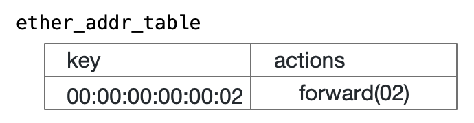

## Tutorial 3: Adding Entries to the Table

As you have tested in Tutorial 1 and 2, Packet I/O processing is performed using StreamMessageRequest / StreamMessageResponse messages of P4Runtime. P4 Runtime also has a WriteRequest message that can be used to update the contents of the P4 Runtime Entity, such as tables. Here, in Tutorial 3, you register the MAC address in a table. And verify that a ping packet from the host attached to the switch outputs to the specified port accordingly.

### Copy a file

Copy the message file (1to2.txt) from this tutorial for adding entries to the /tmp/ether_switch directory you have created for your work. This message includes the info to sends a packet to port 2 for the h2 (MAC address 00:00:00:00:00:02). 



Let's take a look inside the file.

```bash
$ cp 1to2.txt /tmp/ether_switch
$ cat /tmp/ether_switch/1to2.txt 
updates {
  type: INSERT
  entity {
    table_entry {
      table_id: 33592100
      match {
        field_id: 1
        exact {
          value: "\000\000\000\000\000\002" # Octal expression 
        }
      }
      action {
        action {
          action_id: 16838673
          params {
            param_id: 1 
            value: "\x00\x02" # Hexadecimal expression 
          }
        }
      }
    }
  }
}
$
```

The table id: 33592100 stands for MyIngress.ether_add_table, and the id: 1 in its match field stands for hdr.ethernet.dstAddr. The following octal value is 6 bytes long, meaning the MAC address 00:00:00:00:00:02.

You can check this information using the P4 Runtime Shell.

```bash
P4Runtime sh >>> tables["MyIngress.ether_addr_table"] 
Out[2]: 
preamble {
  id: 33592100
  name: "MyIngress.ether_addr_table"
(snip...)
```

Similarly, action_id: 16838673 points to MyIngress.forward, and the value of the following param_id: 1 uses 2 bytes in hexadecimal notation to indicate that the destination port is 2. The confusion at this time is that the definition of [egress_spec](https://github.com/p4lang/p4c/blob/master/p4include/v1model.p4#L80) of standard_metadata in the P4 program is 9 bits wide, and the lower 9 bits of 2 bytes of the value specified by param_id: 1 are used.

```C++
#if V1MODEL_VERSION >= 20200408
typedef bit<9>  PortId_t;       // should not be a constant size?
#endif

@metadata @name("standard_metadata")
struct standard_metadata_t {
#if V1MODEL_VERSION >= 20200408
    PortId_t    ingress_port;
    PortId_t    egress_spec;
    PortId_t    egress_port;
#else
    bit<9>      ingress_port;
    bit<9>      egress_spec;
    bit<9>      egress_port;
#endif
```

(Initially, I was convinced that this would be taken out of the upper bits by 9, so I wrote '\x01\x00' and did not work as expected.)

### Entry adding operation

Execute the Write() function on the P4 Runtime Shell side. The Write() function is originally provided by the P4 Runtime Shell. It reads the message content from the specified file and sends it to the switch as a P4 Runtime WriteRequest message.
No return value or message is returned.

```bash
P4Runtime sh >>> Write("/tmp/1to2.txt")

P4Runtime sh >>> 
```
View the contents of the table to see if it has been added correctly.
```bash
P4Runtime sh >>> table_entry["MyIngress.ether_addr_table"].read(lambda a: print(a))
table_id: 33592100 ("MyIngress.ether_addr_table")
match {
  field_id: 1 ("hdr.ethernet.dstAddr")
  exact {
    value: "\\x00\\x00\\x00\\x00\\x00\\x02"
  }
}
action {
  action {
    action_id: 16838673 ("MyIngress.forward")
    params {
      param_id: 1 ("port")
      value: "\\x00\\x02"
    }
  }
}

P4Runtime sh >>>       
```

For now, we just show you how to check that the entry has been successfully added here. You can also verify that it is actually transmitted by doing the following. 

- Send some packets over Mininet as `h1ping -c 1 h2` (See Tutorial 2)
- Confirm the reception on h2 as `h2 tcpdump -XX -i h2-eth0` (See Tutorial 1)

### Note: Deleting entries

You can display all the registered entries as follows:
```bash
P4Runtime sh >>> table_entry["MyIngress.ether_addr_table"].read(lambda a: print(a))
```
Similarly, you can delete all entries you have registered as follows:
```bash
P4Runtime sh >>> table_entry["MyIngress.ether_addr_table"].read(lambda a: a.delete())
```


## Next Step

#### Tutorial 4: [Packet Round Trip](t4_roundtrip.md)

